# Инструкция по работе с GitHub/GitBash в связке с VisualStudioCode
***
## Первичная подготовка (настройка)
Для того, чтобы начать работу нужно пройти следующие этапы :
* Установить [VisualStudioCode](https://code.visualstudio.com/download);
* Установить [GitBash](https://git-scm.com/download/win);
* Создать учетную запись на [GitHub](https://github.com).

Далее, пока что забываем про учетку на гите и приступаем к связи VisualStudioCode и GitBash. Для этого необходимо открыть VisualStudioCode и, используя сочетание клавиш "CTRL + SHIFT + p", открыть в нем терминал. После чего в выпадающем списке терминала выбираем
 **< Terminal: Select Default Profile >** :
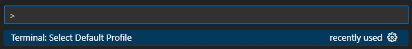

Далее из следующего выпадающего списка выбираем **< Git Bash >** :
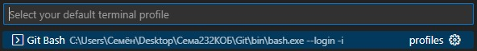

Следующим шагом будет создание папки, для локального репозитория :
 — Создам папку <git_Local> на рабочем столе и помещу ее в папку <Сема232КОБ>;
 — Создам в созданной папке текстовый файл и поменяем его расширение на **".md"** (этот файл понадобится для реализации самой инструкции);
 — Зайду в VisualStudioCode и на вкладке **< Welcome >** выберу пункт **< Open Folder >** :  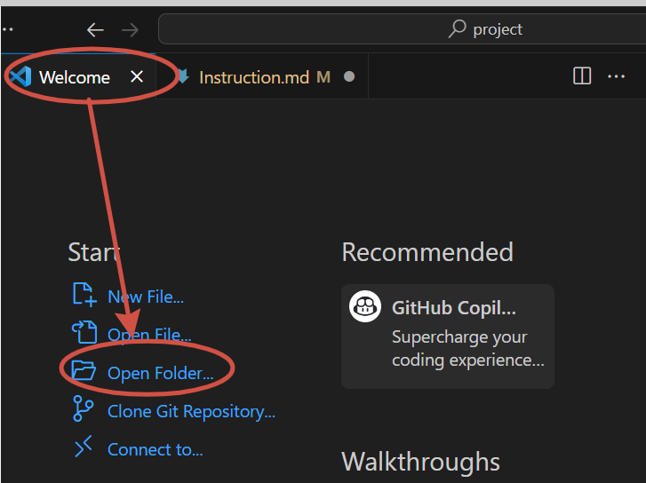 
 — Выбераем созданную папку <git_Local>.

Последним шагом первоначальной настройки будет являться **Инициализация профиля GitHab**. Для этого необходимо открыть терминал, используя соцетание клавиш "CTRL + SHIFT + ~", в который будем вводить команды :
* **git config --global user.name <имя учетки на гите>** — задаем конфигурации имя для коммитов;
* **git config --global user.email <email учетки на гите>** — задаем конфигурации email для коммитов.

Это выглядит следующим образом :
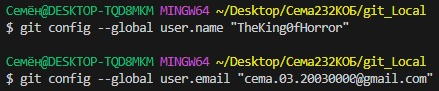

## Инициализация репозитория

Рабочие команды этого блока :
* **git status** — показывает состояние рабочего каталога и промежуточной области. С ее помощью можно проверить индексацию изменений и увидеть файлы, которые не отслеживаются Git;
* **git init** — инициализация репозитория;
* **git add .** — добавляет все файлы из папки в репозиторий.

Для начала проверим первоначальное состояние рабочего каталога, увидим, что репозитория, как такового, нет. Соответственно, далее проводим инициализацию самого репозитория и добавляем в него все файлы из папки :
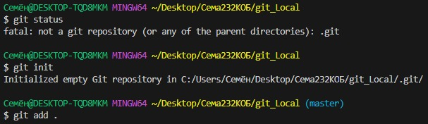

После проделанных действий снова проверяем состояние рабочего каталога и видим, что произошла инициализация репозитория, который содержит один файл :
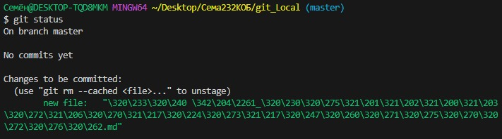

Также при помощи команды **git add <filеname>** можно добавить в репозиторий определенный файл.

## Работа с коммитами

Commit/Коммит — это способ сохранения изменений в коде. Каждый commit содержит информацию о том, что было изменено в коде и кем были внесены эти изменения.

Рабочие команды этого блока :
* **git log** — выводит историю коммитов (кол-во коммитов в текущей ветке);
* **git log --graph** — отображает дерево зависимостей коммитов;
* **git log --oneline** — отображает коммиты в одну строку (только хэш и сообщение);
* **git log --oneline --stat** — отображает статистику изменённых файлов для каждого коммита, при этом в одну строку;
* **git diff** — отображает разницу между любыми двумя Git деревьями;
* **git commit -a -m <имя коммита>** — записывает изменения в репозиторий и автоматически добавляет все измененные файлы в индекс;
* **git commit -m <имя коммита>** — записывает изменения в репозиторий;
* **git commit --amend -m <имя коммита>** — записывает изменения последнего коммита.

Произведем сохранение изменений в репозитории, после чего просмотрим историю коммитов. Увидим, что благодаря коммиту **<double №1>** было произведено сохранение состояния репозитория, т.е. сохранился файл, который мы добавили в него на предыдущем этапе :
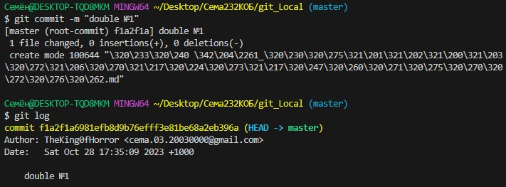

В моей работе были использованы основные команды по работе с коммитами, т.к. в поставленной задаче использование более сложных команд не имеет необходимости.

## Подключение удаленного репозитория

Удаленный репозиторий — это репозиторий, размещенный в локальной или интернет сети. Удаленный репозиторий используется для того, чтобы делиться и обмениваться кодом между разработчиками в рамках сети. Его также можно использовать, если вы разрабатываете проект на нескольких устройствах.

Для подключения удаленного репозитория его необходимо сначала создать. Для этого заходим под своей, ранее созданной учетной записью, в [GitHub](https://github.com) и слева вверху находим зеленую кнопку **"Create repository"**.
 После нажатия на нее, откроется следующее окно:
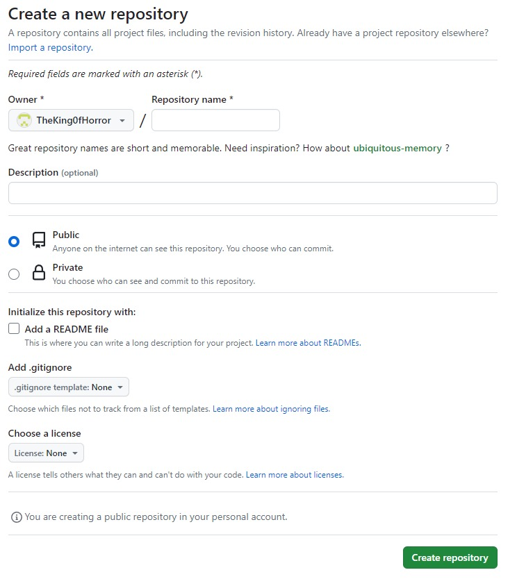
 В данном окне необходимо ввести имя репозитория и указать, что репозиторий будет являться публичным (по желанию можно добавить описание репозитория). После чего нажимаем на зеленую кнопку **"Create repository"** в правом нижнем углу окна. Вуаля! Удаленный репозиторий создан.

Рабочие команды этого блока :
* **git remote add <имя удаленного репозитория> <ссылка на репозиторий>** — добавляет удаленный репозиторий и присваивает ему имя;
* **git push <имя удаленного репозитория> <имя ветки>** — отправляет изменения произведенные в указанной ветке (последний коммит) на сервер.

Подключим, созданный нами ранее, удаленный репозиторий, после чего отправим (запушим) в него изменения текущей ветки :
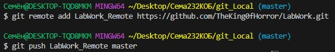

После первоначального пуша, может возникнуть потребность входа в систему GitHab. В данном случае появится окно :
 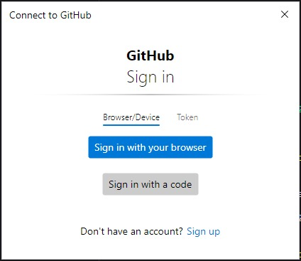

После входа в систему строка пуша побежит дальше, и будет видно, что изменения ветки были выгружены на сервер :
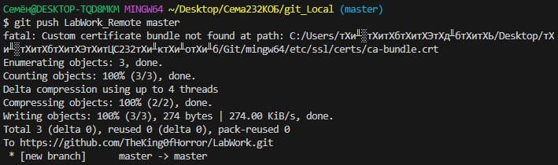

## Ветки в Git

Под веткой принято понимать независимую последовательность коммитов в хронологическом порядке. Однако конкретно в Git реализация ветки выполнена как указатель на последний коммит в рассматриваемой ветке. После создания ветки уже новый указатель ссылается на текущий коммит.

Рабочие команды этого блока :
* **git branch <имя ветки>** — создание новой ветки;
* **git checkout <имя ветки>** — переход в указанную ветку;
* **git merge <имя ветки>** — слияние указанной ветки с основной;
* **git branch -d <имя ветки>** — удаление указанной ветки (нельзя удалить ветку, в которой находишься; нельзя удалить ветку с несохраненными изменениями).

Наглядно рассмотрим данные команды:
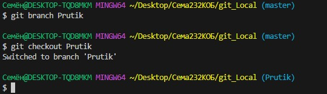
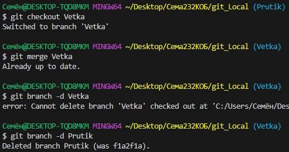

**Возможные конфликты слияния (merge) :**
* Наличие конфликта между текущей локальной веткой и веткой, с которой выполняется слияние. Это свидетельствует о конфликте с кодом другого разработчика. Git сделает все возможное, чтобы объединить файлы, но оставит конфликтующие участки, чтобы вы разрешили их вручную;
 ***Решение :*** нужно изменить конфликтующие файлы вручную;
* Может прерваться в самом начале, если Git обнаруживает изменения в рабочем каталоге или разделе проиндексированных файлов текущего проекта. Git не может выполнить слияние, поскольку иначе эти ожидающие изменения будут перезаписаны новыми коммитами;
 ***Решение :*** локальное состояние необходимо стабилизировать с помощью команд *git stash*, *git checkout*, *git commit* или *git reset*